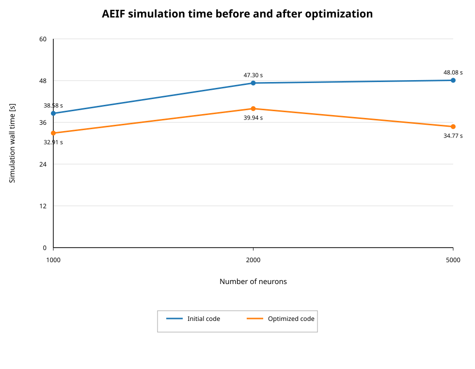
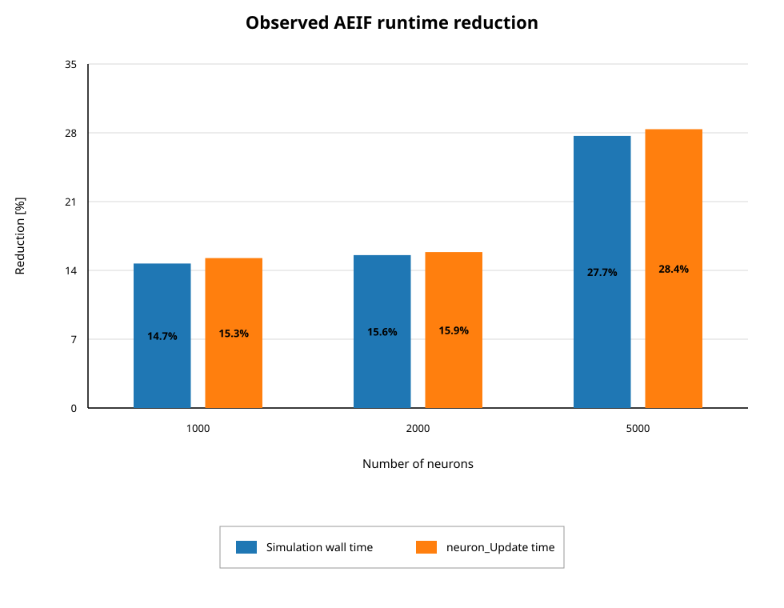

# AEIF resource-management optimization: verification report

**Result: PASS**

This report was generated directly from the combined initial/optimized program and Nsight Systems output.

## Generated diagrams

## Timing and activity

| N | Wall initial [s] | Wall optimized [s] | Reduction | Update initial [s] | Update optimized [s] | Reduction | max. rate difference [Hz] | CV difference |
|---:|---:|---:|---:|---:|---:|---:|---:|---:|
| 1000 | 38.5832 | 32.9119 | 14.7% | 37.1755 | 31.5047 | 15.3% | 0.01000 | 0.0008092 |
| 2000 | 47.3032 | 39.9446 | 15.6% | 45.8023 | 38.5373 | 15.9% | 0.00000 | 0.0000063 |
| 5000 | 48.0831 | 34.7714 | 27.7% | 46.4690 | 33.2881 | 28.4% | 0.00050 | 0.0000532 |

## CUDA API call counts

| N | cudaMalloc initial | optimized | reduction | cudaFree initial | optimized | reduction | cudaMemcpyFromSymbol initial | optimized |
|---:|---:|---:|---:|---:|---:|---:|---:|---:|
| 1000 | 173612 | 74744 | 56.9% | 173585 | 74705 | 57.0% | 10000 | 0 |
| 2000 | 193844 | 91998 | 52.5% | 193817 | 91959 | 52.6% | 10000 | 0 |
| 5000 | 192477 | 82551 | 57.1% | 192450 | 82512 | 57.1% | 10000 | 0 |

## What this test establishes

- The before/after percentages are reproducible from the raw output.
- The optimized run has fewer CUDA allocation/deallocation calls.
- The per-interval `cudaMemcpyFromSymbol` calls disappear.
- The recorded activity remains effectively unchanged within the thresholds used by this test.

## Limitation

This is a verification of the supplied profiler outputs, not a fresh benchmark execution. The log contains one profiler-instrumented run per revision and network size, so it demonstrates the observed paired difference but does not provide a confidence interval or statistical significance. Repeated unprofiled runs are the appropriate next step for runtime variability.
